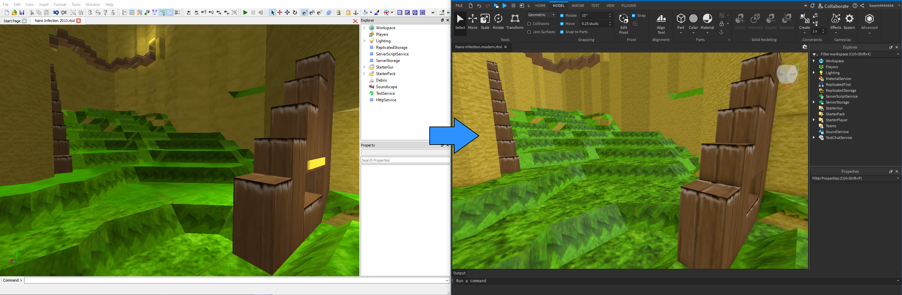

# Classic Terrain Importer
Scripts for porting classic terrain into modern Roblox places. 

> [!WARNING]
> These scripts require a Roblox place file containing terrain that was **not** converted to smooth terrain. You must have a place file containing classic terrain open inside of an older version of Roblox Studio (preferably a 2014 build). Additionally, the imported terrain from these scripts do not support changes while the game is running (i.e. adding/removing voxels).

## How to
Porting classic voxel terrain into modern Roblox is a two step process with these scripts. First, the terrain needs to be **exported** from an old version of studio. Finally, the exported terrain information needs to be **imported** into a modern version of studio. The sections below go into detail on how to accomplish this.

### Exporting

#### Prerequisites
- An old version of Roblox studio (preferably a 2014 build) that:
    - Still has classic voxel terrain support.
    - Supports `ModuleScript`s.
- A place file (.rbxl) that contains voxel terrain that was **not** automatically converted to smooth terrain.

#### Steps
1. Create a `Folder` in `Workspace`. This will designate the areas of terrain you want to export.
2. In the folder, add `Part`s named `KeepArea`. These must be positioned and sized to cover any voxels that should be exported. Voxels not inside a `KeepArea` will be ignored. **IMPORTANT**: `KeepArea` parts must have a rotation of (0,0,0).
3. When you're ready to export, select the folder in the `Explorer` window and then run the [ExportTerrain.lua](./ExportTerrain.lua) script by clicking the `Test -> Run Script` button in the studio ribbonbar. Tip: this script can take a while, open the `Output` window to view its progress.
4. When complete, you will see a `Voxels` folder inside of the terrain folder. This generated folder will be used as part of the import process.

#### Tips (for avoiding studio freezing/crashing)
- Never use the move/resize tools on a `KeepArea` while it's touching/inside of terrain. **This WILL horribly freeze studio** once the part is a decent size and touches a lot of voxels.
- For the same reason as above, never set the `Size` property of a `KeepArea` while it's inside of the terrain. Setting the `Position` property is **OK**.
- Resize `KeepArea`s above the terrain out in the open and then set the `Position.Y` property in the `Properties` window directly to move it down into the terrain. Be sure to use the `Position.Y` property again to move it out of the terrain before resizing the area again!
- Don't modify areas of terrain touching `KeepArea`s, this will lag about as much moving the areas around.
- Use the `Command Bar` to move terrain folders out of `Workspace` and into something else like `Lighting` when you need to edit the actual terrain. Dragging the folder will cause all of the areas to pop out of the terrain, you have to script the move.
- Avoid saving the place file with a generated `Voxels` folder. This can massively increase the file size of the place and may prevent studio from loading it in the future (backups are your friends!).

### Importing

#### Prerequisites
- The generated `Voxels` folder from the above export process.
- The latest version of Roblox Studio.

#### Steps
1. (One time step) Insert the [LegacyTerrainAssets.rbxm](./LegacyTerrainAssets.rbxm) file into `ServerStorage`. This contains necessary assets for generating the terrain parts.
2. Copy (right-click -> copy or `Ctrl+C`) the generated `Voxels` folder that the export script created and then paste it somewhere in a place opened up in a modern version of studio. For example, you could paste it under `Workspace`.
3. Select the `Voxels` folder in the `Explorer` window and then run the [ImportTerrain.lua](./ImportTerrain.lua) script by clicking `Model -> Run Script` in the studio ribbonbar. Tip: this script can take a while, open the `Output` window to view its progress.
4. When complete, you will see a `LegacyTerrain` model appear under `Workspace`.

#### Tips
- When re-importing terrain, delete the old `LegacyTerrain` model first to save on memory/processing power.
- Avoid saving the place with the `Voxels` folder still in it. This can massively increase the file size of the place and may prevent studio from loading it in the future (backups are your friends!).
- Consider closing and re-opening studio after a large or multiple terrain imports. Studio tends to leak memory during this process and can very quickly consume all of your system's available memory.
- **It's recommended to have at least 16 GB of RAM** when running this script. Depending on the size of the terrain being imported, this script can result in extreme memory utilization. Lower RAM may work but if studio starts hitting your pagefile, this script may take a very long time to complete.

## Examples
If you would like example place files to play around with, see the [Tests](./Tests) folder.

## Texture & Mesh Sources
If necessary, all of the textures and meshes used by the importer are available in the [`Textures/Split`](./Textures/Split/) and [`Meshes`](./Meshes) folders respectively. Additionally, the original diffuse texture used by studio is available in the [`Textures`](./Textures) folder (converted to a PNG), although this is not used by the importer.

Note that if you re-upload the textures, you will need to update the asset IDs in the [ImportTerrain.lua](./ImportTerrain.lua) script.
