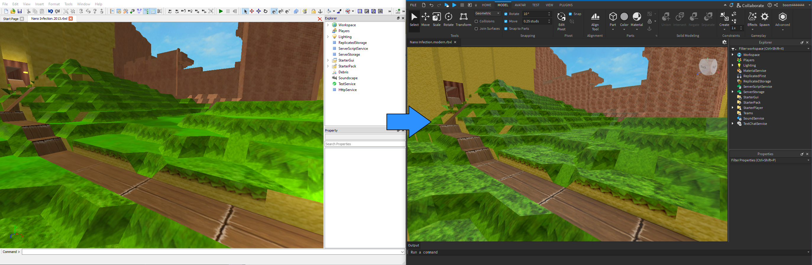

# Roblox Classic Terrain Tools
Scripts and tools for working with classic Roblox voxel terrain, including a set of scripts for importing classic terrain into modern Roblox places.

The tools in this repository make it possible to port older Roblox games that relied on classic voxel terrain for style and/or function into modern Roblox. This is different than the automated process Roblox provides for converting classic voxels into smooth voxels (smooth voxels are not used in any of the tools here). Additionally, there are some tools/mods included to assist in authoring new classic voxel terrain.

> [!IMPORTANT]
> All of the tools and scripts in this repository are designed with 2014 builds of Roblox Studio in mind. Other versions from around that time *may* work but it's not guaranteed.

## Porting Classic Terrain
See the scripts in the [`Importer`](./Importer) folder for bringing classic voxel terrain into modern Roblox. This process will effectively recreate the terrain as parts. This requires a place file open in an older version of Roblox Studio that existed before smooth terrain was introduced. Additionally, the place file must not have already been auto-converted to smooth terrain. The original terrain cannot be recovered after it was converted to smooth terrain.

Continue reading [here](./Importer/README.md).

## Authoring New Classic Terrain
All that's needed to create new terrain is an old version of Roblox Studio and the above mentioned porting scripts. When working with 2014 versions of Studio, you may find the mods in the [`Studio2014Mods`](./Studio2014Mods) folder to be helpful.
